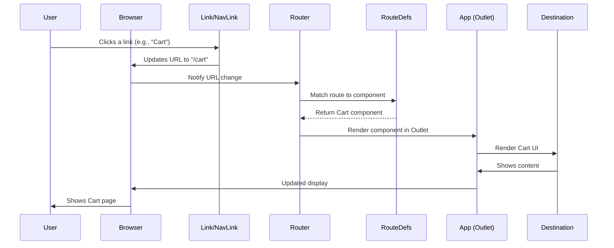

# Chapter 1: Application Routing

Welcome to your first chapter on building the `Internship-Projects` e-commerce website! In this chapter, we're going to talk about "Application Routing." Think of it as the **GPS system for our entire website**. Just like a GPS helps you find your way to different places, application routing helps your website understand which "page" or "view" to show when a user clicks a link or types a specific web address.

### Why Do We Need a GPS for Our Website? (Motivation)

Imagine you're browsing an online shop. You start on the main page, then click on a cool new "Sneakers" section. After that, you click on a specific sneaker to see its details. Finally, you might click on your shopping cart to see what you've added. How does the website know to show you the _correct_ content for each of these actions? This is exactly what **Application Routing** solves!

Without routing, our website would be just one big, messy page. Routing allows us to:

- Have different "addresses" (URLs) for different parts of our site.
- Display the right content (like a product page or a cart) when a user visits a specific address.
- Make the website feel like a smooth, coherent application where users can easily navigate.

Our goal for this chapter is to understand how we can define these "addresses" and make our website respond correctly when a user wants to go to a "Shop" page, a "Product Details" page, or their "Cart."

### Key Concepts: Addresses, Buildings, and Roads

To make routing easy to understand, let's use our GPS analogy:

1.  **Routes (The Addresses):** These are like specific street addresses or points of interest in a city. In our website, these are the paths in the URL, like `/` (for the homepage), `/cart` (for the shopping cart), or `/Detail` (for a product's details).
2.  **Components (The Buildings):** These are the actual "places" or "buildings" that exist at those addresses. In React, our "buildings" are UI components – for example, a `Shop` component for the main shop page, a `Cart` component for the shopping cart, or a `ProductDetail` component for individual product pages.
3.  **Navigation Links (The Roads):** These are the roads, paths, or signs that help you travel between different addresses. On our website, these are the special links (often created using `NavLink` or `Link` from `react-router-dom`) that, when clicked, change the URL and tell the routing system to show a new "building."

### Setting Up Our Website's GPS (How to Use It)

Our project uses a popular library called `react-router-dom` to handle all the routing magic. Let's see how it's set up in our e-commerce application.

#### 1. Defining All the Addresses (`main.jsx`)

The central place where we tell our website about all its available addresses and which "building" (component) lives at each address is in `E-commerce/src/main.jsx`.

Here's how we set up our main `router` using `createBrowserRouter` and `createRoutesFromElements`:

```jsx
// E-commerce/src/main.jsx
import {
  createBrowserRouter, // Helps create our main router
  RouterProvider, // Provides the router to our app
  Route, // Defines a single address and its component
  createRoutesFromElements, // A helper to define routes easily
} from 'react-router-dom';

import Shop from './Component/Shop.jsx'; // Our main shop page component
import ProductDetail from './Component/ProductDetail.jsx'; // Details page
import Cart from './Component/Cart.jsx'; // Shopping cart page
import App from './App.jsx'; // Our main application layout

const router = createBrowserRouter(
  createRoutesFromElements(
    <Route path="/" element={<App />}>
      {/* The '/' path is our homepage. It shows the 'Shop' component by default. */}
      <Route index element={<Shop />} />
      {/* Other paths that show the 'WholeData' component (e.g., "View All" products) */}
      <Route path="arrival" element={<WholeData />} />
      <Route path="sales" element={<WholeData />} />
      <Route path="brands" element={<WholeData />} />
      {/* The '/Detail' path shows the 'ProductDetail' component. */}
      <Route path="/Detail" element={<ProductDetail />}></Route>
      {/* The '/cart' path shows the 'Cart' component. */}
      <Route path="/cart" element={<Cart />}></Route>
    </Route>
  )
);

// This tells React to use our defined router for the entire application.
createRoot(document.getElementById('root')).render(
  <StrictMode>
    <Provider store={store}>
      {' '}
      {/* Redux store for global data, covered in [Central State Management (Redux Store)](05_central_state_management__redux_store__.md) */}
      <RouterProvider router={router} />{' '}
      {/* Connects our router to the React app */}
    </Provider>
  </StrictMode>
);
```

**Explanation:**

- `createBrowserRouter`: This is like the chief planner for our website's GPS. It takes all our defined routes and sets them up.
- `createRoutesFromElements`: This is a handy tool that lets us define our routes using familiar React JSX syntax, making it easy to read.
- `<Route path='/' element={<App />}>`: This is our main "container" route. It says: "Whenever someone visits the very root of our website (`/`), display the `App` component."
- `<Route index element={<Shop />} />`: This is a special route. `index` means "show this component when the parent path (`/`) is exactly matched." So, if you just go to `www.yourshop.com/`, you'll see the `Shop` component.
- `<Route path='arrival' element={<WholeData/>} />`: This defines another address. If you go to `www.yourshop.com/arrival`, it will show the `WholeData` component (which typically displays a list of all products).
- `RouterProvider`: After defining all our routes, we pass them to `RouterProvider` in our `main.jsx` file. This component then makes sure that `react-router-dom` is ready to manage navigation throughout our application.

#### 2. Where Our "Buildings" Appear (`App.jsx`)

When our `router` decides which component to show based on the URL, where does it put it? In `E-commerce/src/App.jsx`, we use a special component called `Outlet`.

```jsx
// E-commerce/src/App.jsx
import React from 'react';
import Header from './Component/Header'; // Our header component
import { Outlet } from 'react-router-dom'; // Crucial for displaying nested routes
import Footer from './Component/Footer'; // Our footer component

const App = () => {
  return (
    <div className="">
      {/* The header always stays at the top, no matter the page */}
      <Header />
      {/* THIS IS WHERE our routing "buildings" (components) will be rendered! */}
      <Outlet></Outlet>
      {/* The footer always stays at the bottom */}
      <Footer></Footer>
    </div>
  );
};

export default App;
```

**Explanation:**
The `Outlet` component acts like a placeholder. When you visit a URL like `/cart`, the `App` component will render, and inside its `Outlet`, the `Cart` component will appear. If you go to `/Detail`, the `ProductDetail` component will appear there instead. This allows us to have a consistent header and footer while only changing the main content area.

#### 3. Creating Our "Roads" (Navigation Links)

Now that we have our addresses and a place to show our components, how do users actually _travel_ between them? We use `Link` and `NavLink` components provided by `react-router-dom`.

- **`Link`**: A basic road for navigation.
- **`NavLink`**: A smarter road that can also tell you if you are _currently_ on that road (useful for highlighting active links in a menu).

Let's look at examples from our `Header` components and product display sections:

**Header Navigation (`DesktopHeader.jsx` and `MobileHeader.jsx`)**

```jsx
// E-commerce/src/Header/DesktopHeader.jsx
import { NavLink, Link } from 'react-router-dom'; // Import Link and NavLink

const DesktopHeader = () => {
  // ... (other code)

  return (
    <div>
      {/* The SHOP.CO logo acts as a link back to the homepage */}
      <Link to="/">
        
      </Link>

      <nav>
        <ul>
          {/* Loop through options to create navigation links */}
          {options.map((item, index) => (
            <li key={index}>
              {/* NavLink to navigate to different pages */}
              <NavLink
                to={item.path} // The 'to' prop is the destination address
                className={
                  ({ isActive }) =>
                    `... ${isActive ? 'font-semibold' : 'text-gray-600'}` // isActive helps style the current page link
                }
              >
                {item.layout}
              </NavLink>
            </li>
          ))}
        </ul>
      </nav>

      {/* ... (other header elements) */}

      {/* Shopping cart icon links to the cart page */}
      <NavLink to="/cart" className="text-gray-800">
        <LuShoppingCart size={28} />
      </NavLink>
    </div>
  );
};
```

**Explanation:**

- `<Link to="/">`: When you click the `SHOP.CO` logo, `react-router-dom` will change the URL to `/`, and since we defined the `/` route to show the `Shop` component (via `index` route in `main.jsx`), the homepage will load.
- `<NavLink to={item.path}>`: For navigation items like "Shop," "New Arrivals," etc., `NavLink` is used. The `to` prop specifies the target URL (e.g., `/arrival`, `/sales`). The `isActive` property is special – it becomes `true` if the current URL matches the `to` prop's path, allowing us to highlight the active page in the navigation bar.
- `<NavLink to="/cart">`: Clicking the shopping cart icon will take the user to the `/cart` page, where the `Cart` component will be displayed.

**Product Display Links (`NewArrival.jsx`, `TopSelling.jsx`, `WholeData.jsx`)**

```jsx
// E-commerce/src/Shop/NewArrival.jsx
import { NavLink } from 'react-router-dom'; // Import NavLink

const NewArrival = () => {
  // ... (other code)

  return (
    <div>
      {/* ... (heading) */}
      <NavLink to="/Detail">
        {' '}
        {/* When you click ANY product in New Arrivals, it goes to /Detail */}
        <div className="flex flex-wrap justify-center gap-6 my-5 cursor-pointer">
          {products.slice(0, 4).map((product) => (
            <div
              key={product.id}
              className="w-[150px] md:w-[220px] flex flex-col gap-[4px] my-5"
              onClick={() => {
                // When a product is clicked, we also update its details in Redux,
                // which the /Detail page will then use. (More on Redux later!)
                dispath(updateDetail({ id: product.id }));
              }}
            >
              
              <h3>{product.title}</h3>
              {/* ... (product details) */}
            </div>
          ))}
        </div>
      </NavLink>

      {/* Button to view all new arrivals */}
      <div className="text-center my-20">
        <NavLink to="/arrival">
          {' '}
          {/* Clicking "View All" goes to /arrival */}
          <span className="border-[1px] border-gray-300 px-[60px] py-[10px] rounded-3xl cursor-pointer hover:bg-gray-100">
            View All
          </span>
        </NavLink>
      </div>
      <hr />
    </div>
  );
};
```

**Explanation:**

- `<NavLink to="/Detail">`: This `NavLink` wraps the entire product display section. This means that if you click on _any_ of the "New Arrival" product images or details, you will be navigated to the `/Detail` page. Before navigating, an `onClick` event on the inner `div` triggers a Redux action to store the `id` of the specific product that was clicked. This way, the `ProductDetail` page knows which product's information to display when it loads.
- `<NavLink to="/arrival">`: Clicking the "View All" button beneath "New Arrivals" will take you to the `/arrival` path, which is configured in `main.jsx` to show the `WholeData` component.

### Under the Hood: How the GPS System Works

Let's simplify how `react-router-dom` acts as our website's GPS.



**Step-by-step Explanation:**

1.  **User Clicks:** You click on a link in the header, like the "Cart" icon.
2.  **Link Action:** The `NavLink` (or `Link`) component, powered by `react-router-dom`, intercepts this click. Instead of a full page reload, it smartly changes only the URL in your browser's address bar to `/cart`.
3.  **Router Notifies:** `react-router-dom` (our "Router") detects this URL change.
4.  **Route Matching:** The Router then looks at the `router` configuration we set up in `main.jsx`. It goes through all the `<Route>` definitions to find one whose `path` matches the current URL (`/cart`).
5.  **Component Selection:** It finds the `<Route path='/cart' element={<Cart/>}>` and knows that the `Cart` component is associated with this path.
6.  **Rendering:** The Router tells the `App` component (specifically, the `Outlet` placeholder inside it) to render the `Cart` component.
7.  **Display:** The `Cart` component's content then appears in the main area of the `App` layout, and you see your shopping cart!

This process happens extremely fast, making the website feel responsive and dynamic without full page reloads.

### Conclusion

In this chapter, we've explored the fundamental concept of **Application Routing**. We learned that it acts as the GPS for our e-commerce website, allowing us to define "addresses" (URLs), associate them with specific "buildings" (React components), and create "roads" (navigation links) for users to travel between them. We saw how `react-router-dom` is used in `main.jsx` to set up our routes and how `NavLink` and `Link` components are used throughout our application (e.g., in `Header` and product displays) to enable seamless navigation.

Understanding routing is crucial because it forms the backbone of how users interact with our multi-page application. In the next chapter, we'll dive into the actual "buildings" themselves: how products are displayed and how their detailed information is presented using **[Product Display & Detail Components](02_product_display___detail_components_.md)**.

---

```

```
