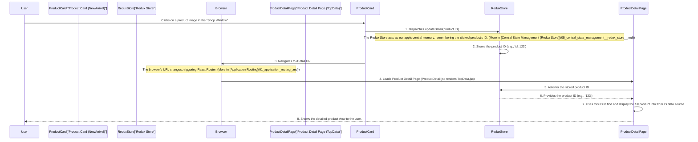

# Chapter 2: Product Display & Detail Components

Welcome back! In [Chapter 1: Application Routing](01_application_routing_.md), we learned how to build the GPS system for our website, allowing users to navigate between different "addresses" or pages. Now that our users can travel, it's time to build the "places" they visit!

This chapter is all about **"Product Display & Detail Components."** Think of this as setting up your shop's window displays and creating detailed product catalogs.

### Why Do We Need Shop Windows and Product Catalogs? (Motivation)

Imagine you walk into a store. What do you see first? Usually, a **shop window** showing off a few exciting new items or bestsellers. You don't see every single detail about every product right there; just enough to catch your eye.

If something in the window catches your attention, you step inside, find that item, and then pick up its **product catalog entry**. This entry gives you _all_ the details: multiple pictures, descriptions, sizes, colors, and maybe even customer reviews.

Our e-commerce website works the same way! We need:

1.  **"Shop Window" Components:** To quickly show many products (like new arrivals or top sellers) with basic info in a simple grid. This helps users browse.
2.  **"Product Catalog" Components:** To show _one specific product_ with all its extensive details, once a user expresses interest.

Our goal for this chapter is to understand how we build these "shop window" and "product catalog" parts of our website.

### Key Concepts: Glance vs. Detail

Let's break down the two main types of components we'll be looking at:

| Component Type                 | Analogy                         | Purpose                                                                                                                              | Examples in Our Project                                  |
| :----------------------------- | :------------------------------ | :----------------------------------------------------------------------------------------------------------------------------------- | :------------------------------------------------------- |
| **Product Display Components** | The Shop Window / Catalog Cover | To show **multiple products** at a glance. They display basic info like an image, name, price, and a quick rating, often in a grid.  | `NewArrival`, `TopSelling`, `WholeData` (for "View All") |
| **Product Detail Components**  | The Product Catalog Entry       | To show **extensive information for a single product**. This includes multiple images, full description, size/quantity options, etc. | `TopData`                                                |

### Building Our Shop Windows and Catalogs (How to Use It)

Let's see how these components work together in our application to display products.

#### 1. Arranging Our Shop Windows (`Shop.jsx`)

Our main shop page (`E-commerce/src/Component/Shop.jsx`) is like the interior of our store. It uses different "shop window" components to showcase various product categories.

```jsx
// E-commerce/src/Component/Shop.jsx
import Hero from '../Shop/Hero';
import NewArrival from '../Shop/NewArrival.jsx'; // Our "New Arrivals" shop window
import TopSelling from '../Shop/TopSelling.jsx'; // Our "Top Selling" shop window
// ... other imports

const Shop = () => {
  return (
    <>
      <Hero /> {/* A big banner at the top */}
      <NewArrival /> {/* Displays new products */}
      <TopSelling /> {/* Displays top-selling products */}
      {/* ... other sections */}
    </>
  );
};

export default Shop;
```

**Explanation:**
The `Shop` component acts as the organizer. It includes `NewArrival` and `TopSelling` (and other sections) to display different collections of products on the main page. Each of these (`NewArrival`, `TopSelling`, and `WholeData` for "View All" pages) is responsible for showing a grid of products with basic information.

#### 2. Designing a Product Card and Making It Clickable (`NewArrival.jsx`)

Let's look inside one of our "shop window" components, `NewArrival.jsx`. This component fetches product data and then loops through it to create individual "product cards." When you click on any product card, two important things happen:

1.  The application "remembers" which specific product you clicked.
2.  You are taken to the detailed product page.

```jsx
// E-commerce/src/Shop/NewArrival.jsx (Core interaction)
// Imagine this inside the part that displays a single product:
import { NavLink } from 'react-router-dom';
import { useDispatch } from 'react-redux';
import { updateDetail } from '../Store/productDetail';

<NavLink to="/Detail">
  {' '}
  {/* Navigates to the product detail page */}
  <div
    onClick={() => {
      // When this product is clicked
      // We send a message to remember WHICH product was clicked.
      dispatch(updateDetail({ id: product.id }));
    }}
  >
    
    <h3>{product.title}</h3>
    {/* ... other display details like price */}
  </div>
</NavLink>;
```

**Explanation:**

- **`<NavLink to="/Detail">`**: This component (from `react-router-dom`) makes the entire product card clickable. When clicked, it tells our application's GPS (our router from [Chapter 1: Application Routing](01_application_routing_.md)) to go to the `/Detail` address.
- **`onClick={() => { dispatch(updateDetail({ id: product.id })); }}`**: This is a special instruction that runs _before_ or _as_ you navigate. `dispatch` is a tool (from Redux, which we'll cover in [Central State Management (Redux Store)](05_central_state_management__redux_store__.md)) that sends a "message" to our application's central memory. The `updateDetail` message tells our app, "Hey, remember `this product's ID` because the user just clicked it!" This ID is crucial for the detail page.

Components like `TopSelling.jsx` and `WholeData.jsx` use very similar logic to display their products and handle clicks.

#### 3. Preparing the Product Detail Page (`ProductDetail.jsx`)

Once you click a product card, our routing system (from [Chapter 1: Application Routing](01_application_routing_.md)) takes you to the `/Detail` page. This page is handled by the `ProductDetail.jsx` component. Its job is quite simple: it just brings in the `TopData` component, which is responsible for showing all the fine print about a single product.

```jsx
// E-commerce/src/Component/ProductDetail.jsx
import TopData from '../ProductDetails/TopData'; // Our detailed product catalog component
import Review from '../ProductDetails/Review'; // Component for reviews

const ProductDetail = () => {
  return (
    <>
      <TopData /> {/* This component displays all the main product details */}
      <Review /> {/* This component shows user reviews for the product */}
    </>
  );
};

export default ProductDetail;
```

**Explanation:**
The `ProductDetail` component serves as a wrapper. It makes sure that when a user lands on `/Detail`, they see the `TopData` component with the product's details and a `Review` section for feedback.

#### 4. Displaying the Product's Deep Dive (`TopData.jsx`)

Finally, we arrive at `TopData.jsx` – our "product catalog entry." This component has a big job: to show _all_ the information for the _one specific product_ that the user clicked. How does it know which product to show? It asks our application's central memory (Redux) for the ID that was saved by `NewArrival` (or `TopSelling`/`WholeData`).

**Part 1: Getting the Right Product's Information**

```jsx
// E-commerce/src/ProductDetails/TopData.jsx (Part 1: Getting Data)
import { useSelector } from 'react-redux'; // Tool to read from app's global memory
import { useContext } from 'react'; // Tool to get data from a shared source
import { DATA } from '../ContextContainer/data'; // Our list of all products

const TopData = () => {
  const selectedId = useSelector((store) => store.Detail.id); // Get ID from global memory
  const { products } = useContext(DATA); // Get ALL product data (more on this in [Global Data Context](03_global_data_context_.md))
  const product = products.find((item) => item.id === selectedId); // Find the chosen product
  // ... (The rest of the component displays 'product')
};
```

**Explanation:**

- `useSelector`: This "listens" to our application's global memory (the Redux store) and grabs the `id` that was saved earlier by `updateDetail`. This is how `TopData` knows which product to display!
- `useContext(DATA)`: This is how we get access to the complete list of _all_ products available in our application. We'll learn more about `Context` in [Global Data Context](03_global_data_context_.md).
- `products.find(...)`: Once we have the `selectedId` and `all products`, we simply use the `find` method to locate the one product object that matches the `selectedId`.

**Part 2: Showing All the Details**

Once `TopData` has found the `product` object using its ID, it can then display all its juicy details: multiple images, full description, pricing, and options like size and quantity selectors.

```jsx
// E-commerce/src/ProductDetails/TopData.jsx (Part 2: Displaying Data)
// (After 'product' is found from global data, as in previous snippet)

const TopData = ({ product }) => {
  // Assume 'product' is ready to be used
  // If for some reason the product wasn't found (e.g., page refresh before ID loaded),
  // we can show a loading message or return.
  if (!product) return <div>Loading product details...</div>;

  return (
    <div>
      {/* Display the main image */}
      
      {/* Display the product title */}
      <h2>{product.title}</h2>
      {/* Display the full description */}
      <p>{product.description}</p>
      {/* ... Add more detailed info: multiple images, price, rating,
          size options, quantity selector, add to cart button, etc. */}
    </div>
  );
};
```

**Explanation:**
This part of the component takes the `product` object and uses its properties (like `thumbnail`, `title`, `description`) to render a rich, detailed view for the user. It's like opening the product catalog to that specific page and seeing everything there is to know!

### Under the Hood: The Journey from Click to Detail

Let's put it all together and see the step-by-step process of how clicking a product display leads to seeing its full details:



This sequence ensures that no matter how the user navigates to the `/Detail` page (by clicking a "New Arrival," "Top Selling," or "View All" product), the `TopData` component will always display the correct product's information because the ID is consistently stored and retrieved from our application's central memory.

### Conclusion

In this chapter, we've explored how our `Internship-Projects` e-commerce application handles displaying products. We distinguished between **Product Display Components** (`NewArrival`, `TopSelling`, `WholeData`) which act as engaging "shop windows," showing multiple products at a glance, and the **Product Detail Component** (`TopData`), which functions as a comprehensive "product catalog entry" for a single selected item.

We saw how clicking a product in a display component triggers an action to remember that product's ID and then navigates the user to the detail page. On the detail page, the `TopData` component uses this remembered ID to fetch and present all the extensive information.

This setup is crucial for creating a user-friendly browsing and shopping experience. In the next chapter, we'll dive deeper into where our application gets all this product data from, by exploring the concept of **[Global Data Context](03_global_data_context_.md)**.

---
