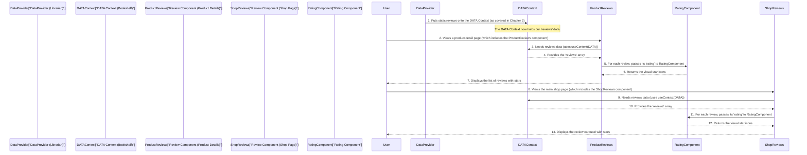

# Chapter 4: User Feedback (Reviews & Ratings)

Welcome back! In [Chapter 3: Global Data Context](03_global_data_context_.md), we learned how to set up a central "shared bookshelf" for our application's data, making product information and customer reviews easily accessible throughout our website. Now that we have this valuable review data, it's time to put it to good use!

This chapter is all about **"User Feedback (Reviews & Ratings)."** Imagine you're shopping online, and you see a cool product. How do you know if it's actually good? You look at what other people say about it! Customer reviews and star ratings are like direct advice from other shoppers, helping you decide if a product is right for you.

### Why Do We Need Customer Opinions and Stars? (Motivation)

Think about the last time you bought something online. Did you check the reviews? Probably! Here's why they're super important for an e-commerce site:

- **Builds Trust:** Real feedback from other buyers makes your shop feel more trustworthy.
- **Helps Decisions:** A quick glance at a 4.5-star rating or a positive review can convince a hesitant buyer.
- **Shows Popularity:** High ratings and many reviews indicate popular, well-loved products.

Our goal for this chapter is to understand how we display these star ratings and customer testimonials. We'll see how a small, reusable "Rating" component handles the stars, and how different "Review" components use it to showcase customer feedback, both on the main shop page and on individual product detail pages.

### Key Concepts: Stars and Stories

To manage user feedback, we'll focus on two main concepts:

| Concept Name                | Analogy                    | Purpose                                                                                                                                   | Examples in Our Project                                                                                                                                                  |
| :-------------------------- | :------------------------- | :---------------------------------------------------------------------------------------------------------------------------------------- | :----------------------------------------------------------------------------------------------------------------------------------------------------------------------- |
| **`Rating.jsx`**            | The "Star Counter"         | A tiny, smart component that takes a number (like 4.5) and visually shows it as a row of full, half, or empty stars. Reusable everywhere. | Used on `Product Detail` page, `Shop` page (New Arrivals, Top Selling, Reviews carousel).                                                                                |
| **`Review.jsx` Components** | The "Customer Storyteller" | Components that gather customer review text and ratings, then display them in a user-friendly way.                                        | `E-commerce/src/ProductDetails/Review.jsx` (lists reviews on product detail page), `E-commerce/src/Shop/Review.jsx` (shows reviews in a carousel on the main shop page). |

### Building Our Stars and Stories (How to Use It)

Let's look at how our project implements these components. Remember, all review data (the names, descriptions, and ratings) comes from our [Global Data Context](03_global_data_context_.md).

#### 1. The Star Counter: `Rating.jsx`

`Rating.jsx` is a very common component. Its only job is to take a numerical rating (like `4.2`) and draw the correct number of stars. This makes sure all star ratings look consistent across the entire website.

```jsx
// E-commerce/src/Shop/Rating.jsx
import React from 'react';
// Imagine Star, StarHalf icons are imported from a library like 'lucide-react'

const Rating = ({ rating }) => {
  const stars = [];
  // This loop adds the correct star icons (full, half, or empty)
  // based on the 'rating' value, for a 5-star system.
  for (let i = 1; i <= 5; i++) {
    if (rating >= i) {
      stars.push(<span key={i}>⭐</span>); // Example: Full star emoji
    } else if (rating >= i - 0.5) {
      stars.push(<span key={i}>🌟</span>); // Example: Half star emoji
    } else {
      stars.push(<span key={i}>☆</span>); // Example: Empty star emoji
    }
  }
  return <div className="flex items-center">{stars}</div>;
};

export default Rating;
```

**Explanation:**

- The `Rating` component receives a `rating` number as a "prop" (input).
- It then calculates how many full stars, half stars, or empty stars to show.
- It returns a collection of `<span>` elements, each representing a star. In our real project, these are beautiful icons, but for simplicity, we're using emojis here!
- This component is designed to be **reusable**. You'll see it used not only in review sections but also next to product prices in `NewArrival.jsx`, `TopSelling.jsx`, and `TopData.jsx` to show their average ratings.

#### 2. The Customer Storyteller (Product Detail Page): `Review.jsx` (in `src/ProductDetails`)

When a user is on an individual product page (which uses `ProductDetail.jsx`, as we saw in [Chapter 2: Product Display & Detail Components](02_product_display___detail_components_.md)), they want to see all the reviews for _that_ product. Our `E-commerce/src/ProductDetails/Review.jsx` component handles this by showing a simple list of all customer feedback.

```jsx
// E-commerce/src/ProductDetails/Review.jsx
import React, { useContext } from 'react';
import { DATA } from '../ContextContainer/data'; // Our shared bookshelf
import Rating from '../Shop/Rating'; // Our star component

const ProductDetailReview = () => {
  const { reviews } = useContext(DATA); // Get ALL reviews from our shared data

  return (
    <div>
      <h3>Customer Reviews</h3>
      {reviews.map(
        (
          review,
          index // Loop through each review
        ) => (
          <div key={index} className="review-card">
            {/* Use our Rating component to show stars for THIS review */}
            <Rating rating={review.rating} />
            <p>Name: {review.name}</p>
            <p>"{review.description}"</p>
          </div>
        )
      )}
    </div>
  );
};

export default ProductDetailReview;
```

**Explanation:**

- `useContext(DATA)`: This line connects to our global data bookshelf (from [Chapter 3: Global Data Context](03_global_data_context_.md)) and picks up the `reviews` array.
- `reviews.map(...)`: This powerful JavaScript function allows us to go through each `review` in the `reviews` array and create a separate display `div` for it.
- `<Rating rating={review.rating} />`: For each review, we pass its specific `rating` to our `Rating` component. This makes sure each customer's star feedback is displayed correctly.

#### 3. The Customer Storyteller (Shop Page Carousel): `Review.jsx` (in `src/Shop`)

On the main shop page (`Shop.jsx`), instead of a long list, we want to give a quick overview of what happy customers are saying. The `E-commerce/src/Shop/Review.jsx` component does this by displaying reviews in a beautiful, rotating carousel.

```jsx
// E-commerce/src/Shop/Review.jsx
import React, { useContext } from 'react';
import { DATA } from '../ContextContainer/data'; // Our shared bookshelf
import Rating from './Rating'; // Our star component
// Imagine 'Slider' component is imported from 'react-slick' to create the carousel effect

const ShopPageReview = () => {
  const { reviews } = useContext(DATA); // Get ALL reviews from our shared data

  // 'Slider' settings and responsive logic are omitted for simplicity.
  // The main focus is how reviews are iterated and Rating is used.
  return (
    <div>
      <h2>What Our Happy Customers Say!</h2>
      {/* Imagine this is the part that makes reviews slide */}
      <div className="carousel-container">
        {reviews.slice(0, 3).map(
          (
            review,
            index // Showing only a few for example
          ) => (
            <div key={index} className="carousel-item">
              <Rating rating={review.rating} />{' '}
              {/* Display stars for this review */}
              <h4>{review.name}</h4>
              <p>"{review.description}"</p>
            </div>
          )
        )}
      </div>
    </div>
  );
};

export default ShopPageReview;
```

**Explanation:**

- Like the `ProductDetailReview` component, this one also uses `useContext(DATA)` to get the `reviews` array.
- It then maps through the `reviews` and, for each one, renders a card that includes the `Rating` component to show the stars.
- The key difference here is the use of a "Slider" (or carousel) component (like `react-slick` used in our project) which makes these review cards slide beautifully across the screen, perfect for a dynamic homepage section.

### Under the Hood: From Shared Bookshelf to Stars

Let's visualize how our review data travels from our global shared bookshelf to become visible stars and stories on our website:



**Step-by-step Explanation:**

1.  **Reviews on the Shelf:** As we learned in [Chapter 3: Global Data Context](03_global_data_context_.md), our `DataProvider` places the `reviews` array onto the `DATA` context when the application starts.
2.  **User Visits Page:** A user navigates to either a product detail page or the main shop page.
3.  **Review Component Renders:** The relevant `Review.jsx` component (either `ProductDetails/Review.jsx` or `Shop/Review.jsx`) is rendered on the page.
4.  **Reads from Bookshelf:** Both `Review` components use `useContext(DATA)` to access the `reviews` array from our `DATA` context.
5.  **Iterates Reviews:** They then loop through each review in the `reviews` array.
6.  **Calls Star Counter:** For each review, they pass its individual `rating` to the `Rating` component.
7.  **Stars Appear:** The `Rating` component calculates and returns the correct star icons, which are then displayed alongside the customer's name and description.
8.  **Displayed to User:** The user sees a clear, visual representation of customer feedback, helping them make informed choices!

### Conclusion

In this chapter, we've explored how our `Internship-Projects` application effectively displays **User Feedback (Reviews & Ratings)**. We saw how the simple yet powerful `Rating.jsx` component is used to visually represent numerical ratings with stars, making it a reusable asset across the entire site. We then looked at the two `Review.jsx` components – one for listing reviews on individual product pages and another for presenting them in an engaging carousel on the main shop page. Both components efficiently retrieve customer review data from our [Global Data Context](03_global_data_context_.md) and use the `Rating` component to show the stars.

## Understanding this system for user feedback is key to building trust and enhancing the shopping experience. In the next chapter, we'll dive into an even more powerful way to manage our application's state and data: **[Central State Management (Redux Store)](05_central_state_management__redux_store__.md)**.
