# Chapter 6: Shopping Cart Functionality

Welcome back! In [Chapter 5: Central State Management (Redux Store)](05_central_state_management__redux_store__.md), we learned how Redux acts as our application's "organized brain," a central place to store and update dynamic data. This powerful brain is absolutely essential for one of the most crucial features of any e-commerce website: the **Shopping Cart!**

### Why Do We Need a Smart Shopping Cart? (Motivation)

Imagine you're in a physical store with a shopping cart. You grab a shirt, then a pair of shoes. The cart keeps track of everything you put in it. If you change your mind, you can remove an item. When you're ready to pay, the cashier scans all the items in your cart and calculates the total.

Our online shopping cart works exactly the same way! It's the core feature that lets users collect items they wish to purchase. But how does our website:

- Remember all the items a user has added, even as they browse other pages?
- Update the number of items shown on the little cart icon in the header?
- Display a clear list of all items in the cart, along with their quantities and prices?
- Calculate the grand total, including things like discounts and delivery charges?

This is where **Shopping Cart Functionality** comes in. Our goal for this chapter is to understand how we build this essential feature using Redux to manage the cart's state and a dedicated component to display it.

### Key Concepts: The Cart's Brain and Display

Our shopping cart functionality relies heavily on Redux (our "organized brain") to keep track of items, and a dedicated React component to display them.

| Concept Name                       | Analogy                          | Purpose                                                                                                                                                                                                              |
| :--------------------------------- | :------------------------------- | :------------------------------------------------------------------------------------------------------------------------------------------------------------------------------------------------------------------- |
| **`CART` Redux Slice (`cart.js`)** | The "Shopping List" in the brain | This is a dedicated section in our Redux Store that precisely remembers _what_ products are in the cart and _how many_ of each. It also knows how to `add` items, `remove` items, and `calculate` the running total. |
| **`Cart.jsx` Component**           | The "Display Area" in the store  | This is the actual page where users can see all the items they've added to their cart. It shows product details, allows quantity changes or removal, and computes the final amount before checkout.                  |
| **`addToCart` Action**             | "Put Item in Cart" instruction   | A message sent to Redux to add a new product or increase the quantity of an existing one in the cart.                                                                                                                |
| **`deleteFromCart` Action**        | "Take Item Out" instruction      | A message sent to Redux to decrease the quantity of an item or remove it entirely from the cart.                                                                                                                     |
| **`totalAmount` Action**           | "Recalculate Total" instruction  | A message sent to Redux to update the total price based on the current items and quantities in the cart.                                                                                                             |

### Building Our Smart Shopping Cart (How to Use It)

Let's dive into how these pieces work together in our application.

#### 1. The Cart's Brain Section: `CART` Slice (`cart.js`)

As we learned in [Chapter 5: Central State Management (Redux Store)](05_central_state_management__redux_store__.md), Redux slices manage specific parts of our application's state. Our `CART` slice is the "brain section" dedicated to knowing everything about the shopping cart.

```jsx
// E-commerce/src/Store/cart.js
import { createSlice } from '@reduxjs/toolkit';

const CART = createSlice({
  name: 'ABC', // Unique name for cart slice
  initialState: {
    arr: [], // An array to hold cart items like: [{ ID: 1, count: 2, price: 100 }]
    totalAmount: 0, // The calculated total cost of items
  },
  reducers: {
    addToCart: (state, action) => {
      const existing = state.arr.find((item) => item.ID === action.payload.ID);
      if (existing) {
        existing.count += action.payload.count; // If item exists, increase count
      } else {
        state.arr.push(action.payload); // If new, add to array
      }
    },
    deleteFromCart: (state, action) => {
      const index = state.arr.findIndex(
        (item) => item.ID === action.payload.id
      );
      if (index !== -1) {
        if (state.arr[index].count > 1) {
          state.arr[index].count--; // If count > 1, decrease count
        } else {
          state.arr.splice(index, 1); // If count is 1, remove item
        }
      }
    },
    totalAmount: (state) => {
      // Calculate total amount based on items in arr
      state.totalAmount = state.arr.reduce(
        (acc, item) => acc + item.price * item.count,
        0
      );
    },
  },
});

// Export all action creators generated by createSlice
export const { addToCart, deleteFromCart, totalAmount } = CART.actions;
export default CART; // Export the reducer itself
```

**Explanation:**

- `name: 'ABC'`: This is the unique identifier for our cart slice.
- `initialState`: When the app first starts, the cart is empty (`arr: []`) and the `totalAmount` is `0`.
- `reducers`: These are the functions that define how the cart's state changes.
  - `addToCart`: This logic is smart! If you add a product that's _already_ in your cart, it just increases the `count`. If it's a _new_ product, it adds the product and its quantity to the `arr` array.
  - `deleteFromCart`: This reducer also handles quantities. If you have multiple of an item and click delete, it first reduces the `count` by one. Only if the `count` becomes zero (or was already one) does it completely remove the item from the `arr`.
  - `totalAmount`: This function goes through all items in the `arr` and calculates the sum of (`price * count`) for each, updating the `totalAmount` in our Redux Store.

#### 2. Adding Items to the Cart (`TopData.jsx`)

When a user is on a product's detail page ([Chapter 2: Product Display & Detail Components](02_product_display___detail_components_.md)) and clicks the "ADD TO CART" button, we need to send a message to our Redux brain to update the cart.

```jsx
// E-commerce/src/ProductDetails/TopData.jsx (Simplified)
import { useDispatch } from 'react-redux';
import { addToCart } from '../Store/cart.js'; // Import our action creator

const TopData = () => {
  const dispatch = useDispatch(); // Get the dispatch function
  // ... (Assume PRODUCT and count are available from component's state/props)

  return (
    // ... (rest of product details component)
    <div
      className="text-white w-full text-center bg-black px-6 py-2 rounded-full cursor-pointer"
      onClick={() => {
        // Dispatch the addToCart action with product details
        dispatch(
          addToCart({
            ID: PRODUCT[0].id, // The product's unique ID
            count: count, // How many of this product to add
            price: PRODUCT[0].price, // The product's price
          })
        );
        // Reset local quantity count to 1 after adding to cart
        updateCount(1);
      }}
    >
      ADD
    </div>
  );
};
```

**Explanation:**
When the "ADD" button is clicked, `dispatch(addToCart(...))` sends a message containing the `ID`, `count`, and `price` of the product. Our `CART` slice's `addToCart` reducer then processes this message and updates the central cart state.

#### 3. Showing Item Count in the Header (`DesktopHeader.jsx`)

Once items are in the cart, it's helpful to show a small number on the shopping cart icon in the header, letting the user know how many items they've collected.

```jsx
// E-commerce/src/Header/DesktopHeader.jsx (Simplified)
import { useSelector } from 'react-redux';
import { LuShoppingCart } from 'react-icons/lu'; // Shopping cart icon

const DesktopHeader = () => {
  // Read the 'arr' (array of cart items) from the 'CART' slice in Redux
  const AllProduct = useSelector((store) => store.CART.arr);

  let countProduct = 0;
  for (let i = 0; i < AllProduct.length; i++) {
    countProduct += AllProduct[i].count; // Sum up quantities of all items
  }

  return (
    // ... (rest of header)
    <div className="relative inline-block">
      <NavLink to="/cart" className="text-gray-800">
        <LuShoppingCart size={28} />
        {countProduct > 0 && ( // Only show count if greater than 0
          <span className="absolute -top-2 -right-2 bg-red-600 text-white text-xs font-bold rounded-full h-5 w-5 flex items-center justify-center">
            {countProduct} {/* Display the total count */}
          </span>
        )}
      </NavLink>
    </div>
  );
};
```

**Explanation:**
`useSelector((store) => store.CART.arr)` allows `DesktopHeader.jsx` to "listen" to changes in the `arr` (cart items) inside our `CART` Redux slice. Whenever an item is added or removed, `AllProduct` updates, and the `countProduct` is recalculated, automatically updating the number next to the cart icon.

#### 4. Displaying the Shopping Cart Page (`Cart.jsx`)

The `Cart.jsx` component ([Chapter 1: Application Routing](01_application_routing_.md) showed its route) is the dedicated "display area" for the cart. It shows all the products, allows removal, and calculates the final total.

**Part 1: Getting Cart Data and Calculating Total**

```jsx
// E-commerce/src/Component/Cart.jsx (Part 1: Getting Data)
import React, { useContext, useEffect } from 'react';
import { useSelector, useDispatch } from 'react-redux';
import { DATA } from '../ContextContainer/data'; // Our global products list
import { totalAmount } from '../Store/cart'; // Our action to calculate total

const Cart = () => {
  const { products } = useContext(DATA); // Get ALL products from global data
  // Get cart items and total amount from our Redux Store
  const AllProducts = useSelector((store) => store.CART.arr);
  const TOTAL_AMOUNT = useSelector((store) => store.CART.totalAmount);
  const dispatch = useDispatch();

  // IMPORTANT: Recalculate total amount whenever cart items change
  useEffect(() => {
    dispatch(totalAmount()); // Dispatch the totalAmount action
  }, [AllProducts]); // This effect runs whenever AllProducts array changes

  if (AllProducts.length === 0) {
    return <div className="text-center my-15">Your cart is empty</div>;
  }

  // ... (rest of component to display items and calculate final bill)
};
```

**Explanation:**

- `useContext(DATA)`: We still need access to our global `products` list (from [Chapter 3: Global Data Context](03_global_data_context_.md)) so we can find the full details (like images, descriptions) for the products that are only stored by their `ID` in the `CART` Redux slice.
- `useSelector`: We use `useSelector` to read the `arr` (our actual cart items) and `totalAmount` from the `CART` slice.
- `useEffect` and `dispatch(totalAmount())`: This is crucial! Every time the `AllProducts` array (our cart items) changes (e.g., an item is added or removed), this `useEffect` hook automatically runs. It then dispatches the `totalAmount()` action to our Redux Store, which tells the `CART` slice to re-run its `totalAmount` reducer and update the `totalAmount` state in Redux. This ensures the total is always up-to-date.

**Part 2: Displaying Items and Calculating Final Bill**

The `Cart.jsx` component then loops through the `AllProducts` (items from the Redux cart), finds their full details using the global `products` list, and displays them. It also handles deleting items and shows the final bill.

```jsx
// E-commerce/src/Component/Cart.jsx (Part 2: Displaying Data & Logic)
// (After getting AllProducts, TOTAL_AMOUNT, and dispatch as shown in Part 1)
import { RiDeleteBin6Fill } from 'react-icons/ri'; // Delete icon
import { deleteFromCart } from '../Store/cart'; // Action to delete

const Cart = () => {
  // ... (AllProducts, TOTAL_AMOUNT, dispatch setup from Part 1)
  // ... (if cart is empty check)

  return (
    <div className="mx-4 md:mx-[5%] h-auto pb-10">
      <h1 className="text-xl md:text-2xl font-sans font-extrabold my-4">
        YOUR CART
      </h1>
      <div className="flex flex-wrap max-w-full justify-between">
        <div>
          {AllProducts.map((cartItem) => {
            // Find full product details using the ID from the cart item
            const product = products.find((p) => p.id === cartItem.ID);
            if (!product) return null; // Handle case where product not found

            return (
              <div
                key={product.id}
                className="flex border rounded-2xl p-3 mb-4"
              >
                <span // Delete button for each item
                  onClick={() => {
                    dispatch(deleteFromCart({ id: product.id })); // Dispatch delete action
                  }}
                  className="absolute top-1 right-1.5 text-red-500 cursor-pointer"
                >
                  <RiDeleteBin6Fill />
                </span>
                
                <div className="flex flex-col gap-2 text-sm ml-4">
                  <div className="font-semibold">{product.title}</div>
                  <div className="text-sm text-gray-500">
                    Quantity: {cartItem.count}
                  </div>
                  <div className="font-bold">
                    ${Math.round(product.price * cartItem.count)}
                  </div>
                </div>
              </div>
            );
          })}
        </div>

        {/* Total Summary Section */}
        <div className="w-full md:w-[300px] px-4 py-6 bg-gray-100 rounded-xl">
          <h2 className="text-lg font-extrabold mb-2">Total Summary</h2>
          <div className="flex justify-between">
            <span>Price:</span>
            <span>${Math.round(TOTAL_AMOUNT)}</span>
          </div>
          <div className="flex justify-between">
            <span>Discount(20%):</span>
            <span className="text-red-600">
              -${Math.round(TOTAL_AMOUNT * 0.2)}
            </span>
          </div>
          <div className="flex justify-between">
            <span>Delivery Charges:</span>
            <span>$15</span>
          </div>
          <hr className="my-2" />
          <div className="flex justify-between text-lg font-extrabold">
            <span>Total Charges:</span>
            <span>${Math.round(TOTAL_AMOUNT - TOTAL_AMOUNT * 0.2 + 15)}</span>
          </div>
        </div>
      </div>
    </div>
  );
};
```

**Explanation:**

- **Mapping `AllProducts`:** The `Cart.jsx` component maps through `AllProducts` (the cart items from Redux). For each `cartItem`, it finds the full `product` details from our globally available `products` list.
- **Delete Button:** Clicking the delete icon for an item dispatches `deleteFromCart({ id: product.id })`. This action updates the `CART` slice in Redux, which in turn triggers the `useEffect` to re-calculate the `totalAmount`.
- **Total Summary:** This section displays the `TOTAL_AMOUNT` obtained from Redux. It then manually calculates and displays the discount (20% of `TOTAL_AMOUNT`), a fixed delivery charge ($15), and the final `Total Charges` (TOTAL_AMOUNT - discount + delivery).

### Under the Hood: The Cart's Journey

Let's visualize the typical flow when a user interacts with the shopping cart, from adding an item to seeing the updated total:

```mermaid
sequenceDiagram
    participant User
    participant ProductDetailComp["Product Detail (TopData.jsx)"]
    participant DispatchFunction["dispatch()"]
    participant AddToCartAction["addToCart Action"]
    participant CARTReducer["CART Slice Reducer (cart.js)"]
    participant ReduxStore["Redux Store"]
    participant HeaderComp["Header (DesktopHeader.jsx)"]
    participant CartPageComp["Cart Page (Cart.jsx)"]
    participant BrowserUI["Browser UI"]

    User->>ProductDetailComp: 1. Clicks "Add to Cart" button
    ProductDetailComp->>DispatchFunction: 2. Calls dispatch(addToCart Action)
    DispatchFunction->>AddToCartAction: 3. Creates addToCart Action object
    AddToCartAction->>ReduxStore: 4. Sends Action to Redux Store
    ReduxStore->>CARTReducer: 5. Redux Store sends current CART State and Action to CART Reducer
    CARTReducer->>ReduxStore: 6. CART Reducer returns a NEW updated CART State
    ReduxStore->>HeaderComp: 7. Redux Store notifies Header (via useSelector)
    ReduxStore->>CartPageComp: 8. Redux Store notifies Cart Page (via useSelector)
    HeaderComp->>BrowserUI: 9. Header re-renders with new cart item count
    CartPageComp->>BrowserUI: 10. Cart page re-renders with updated item list
    BrowserUI->>User: 11. User sees updated cart count and items

    User->>CartPageComp: 12. Clicks "Delete" icon on an item
    CartPageComp->>DispatchFunction: 13. Calls dispatch(deleteFromCart Action)
    DispatchFunction->>ReduxStore: 14. Sends deleteFromCart Action
    ReduxStore->>CARTReducer: 15. Redux Store sends current CART State and Action to CART Reducer
    CARTReducer->>ReduxStore: 16. CART Reducer returns NEW updated CART State
    ReduxStore->>CartPageComp: 17. Redux Store notifies Cart Page (via useSelector)
    CartPageComp->>DispatchFunction: 18. Cart Page's useEffect dispatches totalAmount Action
    DispatchFunction->>ReduxStore: 19. Sends totalAmount Action
    ReduxStore->>CARTReducer: 20. Redux Store sends current CART State and totalAmount Action to CART Reducer
    CARTReducer->>ReduxStore: 21. CART Reducer returns NEW updated CART State with new totalAmount
    ReduxStore->>CartPageComp: 22. Redux Store notifies Cart Page (via useSelector)
    CartPageComp->>BrowserUI: 23. Cart page re-renders with updated list and total
    BrowserUI->>User: 24. User sees updated cart and bill
```



**Step-by-step Explanation:**

1.  **Adding an Item:**

    - **User Clicks:** When you click "Add to Cart" on a product detail page (`TopData.jsx`).
    - **Dispatch Action:** `TopData.jsx` uses `dispatch` to send an `addToCart` action, carrying the product's details.
    - **Reducer Updates State:** This action goes to the `CART` slice's reducer (`cart.js`). The reducer updates the `arr` (cart items) in the Redux Store based on the `addToCart` logic (adding new item or increasing quantity). It creates a _new_ state for the cart.
    - **Components Update:** The Redux Store notifies any components listening to the `CART` state via `useSelector`. The `DesktopHeader.jsx` updates its cart item count, and if you're on the `Cart.jsx` page, it will immediately display the new item.

2.  **Deleting/Updating an Item:**
    - **User Clicks:** You click the delete icon on an item in the `Cart.jsx` page.
    - **Dispatch Action:** `Cart.jsx` uses `dispatch` to send a `deleteFromCart` action with the item's ID.
    - **Reducer Updates State:** The `CART` slice's `deleteFromCart` reducer processes this, either reducing the item's count or removing it entirely.
    - **Cart Page Reacts (First):** `Cart.jsx` (and the header) immediately re-render to show the updated list of items.
    - **Recalculate Total:** Crucially, a `useEffect` in `Cart.jsx` notices that the `AllProducts` array (cart items) has changed. It then automatically dispatches the `totalAmount()` action.
    - **Total Recalculated:** The `CART` slice's `totalAmount` reducer runs, recalculating the `totalAmount` in the Redux Store.
    - **Cart Page Reacts (Second):** `Cart.jsx` re-renders _again_ to display the newly calculated total, including discounts and delivery charges.

This intricate but highly organized flow, powered by Redux, ensures that your shopping cart is always accurate and responsive, providing a smooth experience for the user.

### Conclusion

In this chapter, we've explored the critical **Shopping Cart Functionality**. We learned how the `CART` Redux slice (`cart.js`) acts as our application's "shopping list," precisely managing items, quantities, and their individual prices through `addToCart`, `deleteFromCart`, and `totalAmount` actions. We also saw how the `Cart.jsx` component serves as the user-facing "display area," retrieving cart data from Redux, enabling item removal, and calculating the final bill. Finally, we saw how the header always stays up-to-date with the cart's item count.

This robust system, built on central state management, is fundamental to any e-commerce application, providing a seamless and reliable shopping experience.

---
