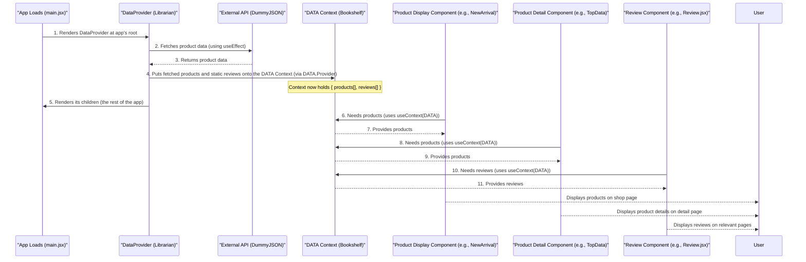

# Chapter 5: Central State Management (Redux Store)

Welcome back! In [Chapter 4: User Feedback (Reviews & Ratings)](04_user_feedback__reviews___ratings__.md), we focused on displaying customer opinions, building on our understanding of how shared data is made available through [Global Data Context](03_global_data_context_.md). Context is fantastic for making _static_ data (like our list of products or pre-defined reviews) available throughout our application. But what happens when our application's data needs to _change_ frequently, and many different parts of the app need to react to those changes instantly and predictably?

This chapter introduces **"Central State Management (Redux Store)."** Imagine your application has a single, highly organized **brain**. This "brain" (which we call the **Redux Store**) is where _all_ the important pieces of information that can change during a user's session are kept. Think of things like:

- Which product the user has currently clicked to view details.
- What items are in the shopping cart and how many of each.
- Whether a mobile menu is open or closed.

Instead of trying to pass this constantly changing information around messy like a game of telephone, Redux provides one central "source of truth." Different parts of the app can easily "read" from this central brain and "send messages" to change it, ensuring everyone has the most up-to-date information without confusion.

### Why Do We Need an Organized Brain for Our App? (Motivation)

Consider our e-commerce website:

- When you click a product, the `ProductDetail` page needs to know _which_ product you clicked. This ID changes every time you click a different product.
- When you add an item to the shopping cart, the cart icon in the header needs to update its number, and the `Cart` page needs to show the new item. When you remove an item, everything needs to update again.
- If we manage these changing pieces of data (often called "state") in individual components, things can quickly get complicated, especially when many components depend on the same data.

**Redux** solves this by centralizing all changeable data in one place, making updates predictable and easy to track. Our goal for this chapter is to understand how Redux acts as this "central brain" to manage dynamic data like the currently selected product ID and the items in our shopping cart.

### Key Concepts: The Brain's Operations

To understand Redux, let's break down how this "organized brain" operates:

| Redux Concept        | Analogy                                    | Purpose                                                                                                                                                                                                             |
| :------------------- | :----------------------------------------- | :------------------------------------------------------------------------------------------------------------------------------------------------------------------------------------------------------------------ |
| **Store**            | The Brain Itself (the central memory unit) | The single source of truth that holds all your application's state (data). There's only one Store in an application.                                                                                                |
| **State**            | The Brain's Current Thoughts/Memories      | The actual data stored inside the Store at any given moment (e.g., `id: 123`, `cart: [...]`).                                                                                                                       |
| **Action**           | An Intentional Message                     | A plain JavaScript object that describes "what happened" (e.g., `ADD_TO_CART`, `PRODUCT_SELECTED`). It's a command, not an instruction on _how_ to change.                                                          |
| **Reducer**          | A Brain's Logic Department                 | A pure function that takes the current `state` and an `action`, and returns a _new_ state. Reducers are the _only_ way to change the state. Each reducer handles a specific "slice" of the state.                   |
| **`dispatch`**       | Sending a Message                          | A function that sends an `action` to the Redux Store. This is how a component tells the Store that something happened.                                                                                              |
| **`useSelector`**    | Reading a Memory                           | A special React-Redux tool (Hook) that allows your React components to "read" specific pieces of data from the Red Store. It automatically updates your component when that piece of data changes.                  |
| **`configureStore`** | Setting up the Brain                       | The function from `@reduxjs/toolkit` that creates the Redux Store, combining all your individual "logic departments" (reducers).                                                                                    |
| **`createSlice`**    | Creating a Brain Department                | A powerful function from `@reduxjs/toolkit` that simplifies defining an initial state, actions, and reducers for a specific "slice" of your application's state (e.g., a "cart" slice or a "product detail" slice). |

### Setting Up Our Organized Brain (How to Use It)

Our project uses `@reduxjs/toolkit` (a recommended way to use Redux) and `react-redux` (to connect Redux to our React components).

#### 1. Setting Up the Brain (`store.js`)

First, we create our central Redux Store. This is like turning on the main power for our application's brain.

```jsx
// E-commerce/src/Store/store.js
import { configureStore } from '@reduxjs/toolkit';
import Detail from './productDetail'; // Our product detail department
import CART from './cart'; // Our shopping cart department
// ... other imports for other departments

const store = configureStore({
  reducer: {
    Detail: Detail.reducer, // Connect the product detail logic
    CART: CART.reducer, // Connect the shopping cart logic
    // ... connect other reducers here
  },
});

export default store;
```

**Explanation:**

- `configureStore`: This is the function that actually creates our Redux `store`.
- `reducer`: This property is where we tell Redux about all the different "logic departments" (our reducers) that will manage different parts of our application's state. We give each department a name (`Detail`, `CART`) which we'll use later to access their data.

#### 2. Defining Brain Sections (Slices & Reducers)

Instead of one giant brain department, Redux encourages breaking down your state into smaller, manageable "slices." Each slice is responsible for a specific part of your application's data.

**A. Product Detail Slice (`productDetail.js`)**

This slice manages the `id` of the product currently selected by the user.

```jsx
// E-commerce/src/Store/productDetail.js
import { createSlice } from '@reduxjs/toolkit';

const Detail = createSlice({
  name: 'ABC_Detail', // A unique name for this slice
  initialState: {
    id: null, // The default state: no product selected initially
  },
  reducers: {
    updateDetail: (state, action) => {
      // This is the logic for the 'updateDetail' action
      state.id = action.payload.id; // Update the 'id' with the one from the message
    },
  },
});

export const { updateDetail } = Detail.actions; // Export the action creator
export default Detail; // Export the reducer itself
```

**Explanation:**

- `createSlice`: This simplifies creating Redux logic. You give it a `name`, an `initialState`, and a `reducers` object.
- `initialState`: Defines what this part of the brain remembers when the app starts. Here, `id` is `null`.
- `reducers`: Contains functions that describe how the state should change in response to specific `actions`.
  - `updateDetail`: This is a reducer function. When the `updateDetail` action is dispatched, this function runs. It takes the current `state` (e.g., `{ id: null }`) and the `action` (e.g., `{ type: 'ABC_Detail/updateDetail', payload: { id: 123 } }`). It then updates the `id` in the state to `action.payload.id`.
- `export const { updateDetail } = Detail.actions;`: `createSlice` automatically generates "action creators" for us. `updateDetail` is a function that, when called (e.g., `updateDetail({ id: 123 })`), creates the correct `action` object.

**B. Shopping Cart Slice (`cart.js`)**

This slice manages all the items currently in the user's shopping cart and calculates the total amount.

```jsx
// E-commerce/src/Store/cart.js
import { createSlice } from '@reduxjs/toolkit';

const CART = createSlice({
  name: 'ABC_Cart', // Unique name for cart slice
  initialState: {
    arr: [], // Array to hold cart items (e.g., [{ ID: 1, count: 2, price: 100 }])
    totalAmount: 0, // Total cost of items in cart
  },
  reducers: {
    addToCart: (state, action) => {
      const existing = state.arr.find((item) => item.ID === action.payload.ID);
      if (existing) {
        existing.count += action.payload.count; // If item exists, increase count
      } else {
        state.arr.push(action.payload); // If new, add to array
      }
    },
    deleteFromCart: (state, action) => {
      const index = state.arr.findIndex(
        (item) => item.ID === action.payload.id
      );
      if (index !== -1) {
        if (state.arr[index].count > 1) {
          state.arr[index].count--; // If count > 1, decrease count
        } else {
          state.arr.splice(index, 1); // If count is 1, remove item
        }
      }
    },
    totalAmount: (state) => {
      // Calculate total amount based on items in arr
      state.totalAmount = state.arr.reduce(
        (acc, item) => acc + item.price * item.count,
        0
      );
    },
  },
});

// Export all action creators
export const { addToCart, deleteFromCart, totalAmount } = CART.actions;
export default CART; // Export the reducer
```

**Explanation:**
Similar to `productDetail.js`, this slice defines the `initialState` for the cart (`arr` for items, `totalAmount`). It also has three reducers:

- `addToCart`: Adds a product to the cart or increases its quantity if it's already there.
- `deleteFromCart`: Removes a product from the cart or decreases its quantity.
- `totalAmount`: Recalculates the total price of all items in the cart.

#### 3. Sending Messages to the Brain (`useDispatch`)

Components "talk" to the Redux Store by sending (dispatching) actions. This is done using the `useDispatch` Hook from `react-redux`.

**A. Updating Selected Product ID (in `NewArrival.jsx` and similar components)**

When a user clicks on a product card, we need to tell Redux which product's ID was selected so the `ProductDetail` page can display the correct information.

```jsx
// E-commerce/src/Shop/NewArrival.jsx (Simplified)
import { useDispatch } from 'react-redux';
import { updateDetail } from '../Store/productDetail'; // Our action creator

const NewArrival = () => {
  const dispatch = useDispatch(); // Get the dispatch function

  // ... (inside the product map where a single product card is rendered)
  <div
    onClick={() => {
      // Send a message (action) to the Redux Store
      // The 'updateDetail' action will update the 'Detail' slice's 'id'.
      dispatch(updateDetail({ id: product.id }));
    }}
  >
    {/* Product image and details */}
  </div>;
};
```

**Explanation:**

- `useDispatch()`: Gives us a `dispatch` function.
- `dispatch(updateDetail({ id: product.id }))`: This line sends the `updateDetail` action to our Redux Store. The `payload` (`{ id: product.id }`) carries the specific data (the product's ID) needed for the update.

**B. Adding to Cart (in `TopData.jsx`)**

When a user clicks "Add to Cart" on a product's detail page, we need to update the cart in our Redux Store.

```jsx
// E-commerce/src/ProductDetails/TopData.jsx (Simplified)
import { useDispatch } from 'react-redux';
import { addToCart } from '../Store/cart.js'; // Our action creator

const TopData = () => {
  const dispatch = useDispatch();
  // ... (get product ID and count from state)

  return (
    // ... (rest of component)
    <div
      onClick={() => {
        // Send the 'addToCart' action to update the CART slice
        dispatch(
          addToCart({
            ID: PRODUCT[0].id,
            count: count,
            price: PRODUCT[0].price,
          })
        );
        // Reset local count after adding to cart
        updateCount(1);
      }}
    >
      ADD TO CART
    </div>
  );
};
```

**Explanation:**
Here, `dispatch(addToCart(...))` sends an action with the product's `ID`, `count`, and `price` to the `CART` slice, which then updates the `arr` array in the Redux Store.

**C. Deleting from Cart (in `Cart.jsx`)**

When a user clicks the delete button in the cart, we dispatch an action to remove or decrease the quantity of that item.

```jsx
// E-commerce/src/Component/Cart.jsx (Simplified)
import { useDispatch } from 'react-redux';
import { deleteFromCart, totalAmount } from '../Store/cart'; // Action creators

const Cart = () => {
  const dispatch = useDispatch();

  return (
    // ... (inside product map in cart)
    <span
      onClick={() => {
        // Send 'deleteFromCart' action
        dispatch(deleteFromCart({ id: product.id }));
        // Recalculate total amount after item change
        dispatch(totalAmount());
      }}
    >
      {/* Delete icon */}
    </span>
  );
};
```

**Explanation:**
`dispatch(deleteFromCart({ id: product.id }))` tells the Redux Store to modify the cart, and `dispatch(totalAmount())` ensures the total is updated immediately.

#### 4. Reading from the Brain (`useSelector`)

Components "read" from the Redux Store using the `useSelector` Hook. This hook is smart: it only re-renders your component if the specific piece of data you're "selecting" actually changes.

**A. Getting Selected Product ID (in `TopData.jsx`)**

The `TopData.jsx` component needs to know which product ID was saved by the `NewArrival` component.

```jsx
// E-commerce/src/ProductDetails/TopData.jsx (Simplified)
import { useSelector } from 'react-redux';

const TopData = () => {
  // Read the 'id' from the 'Detail' slice of the Redux Store
  const selectedId = useSelector((store) => store.Detail.id);
  // 'store' here represents the entire Redux state object.

  // Now use 'selectedId' to find the product from your global products data
  // (as seen in Chapter 2, using useContext(DATA) for all products)
};
```

**Explanation:**
`useSelector((store) => store.Detail.id)` tells Redux: "Give me the `id` property from the `Detail` slice of your `store`." If that `id` ever changes, `TopData` will automatically re-render with the new `id`.

**B. Getting Cart Products and Total (in `DesktopHeader.jsx` and `Cart.jsx`)**

The header needs to show the number of items in the cart, and the `Cart` page needs to display all cart items and the total.

```jsx
// E-commerce/src/Header/DesktopHeader.jsx (Simplified)
import { useSelector } from 'react-redux';

const DesktopHeader = () => {
  // Read the 'arr' (array of cart items) from the 'CART' slice
  const AllProduct = useSelector((store) => store.CART.arr);

  let countProduct = 0;
  for (let i = 0; i < AllProduct.length; i++) {
    countProduct += AllProduct[i].count; // Calculate total count
  }
  // ... display countProduct next to cart icon
};
```

```jsx
// E-commerce/src/Component/Cart.jsx (Simplified)
import { useSelector } from 'react-redux';

const Cart = () => {
  // Read the 'arr' and 'totalAmount' from the 'CART' slice
  const AllProducts = useSelector((store) => store.CART.arr);
  const TOTAL_AMOUNT = useSelector((store) => store.CART.totalAmount);

  // ... display AllProducts and TOTAL_AMOUNT
};
```

**Explanation:**
Both components use `useSelector` to get the `arr` (cart items) and `totalAmount` from the `CART` slice. As these values change due to `addToCart` or `deleteFromCart` actions, the components automatically update their display.

#### 5. Connecting Redux to React (`main.jsx`)

Finally, to make our Redux Store available to _all_ our React components, we wrap our entire application with the `Provider` component from `react-redux` in our `main.jsx` file.

```jsx
// E-commerce/src/main.jsx
import React from 'react';
import ReactDOM from 'react-dom/client';
import App from './App.jsx';
// ... other imports

import store from './Store/store.js'; // Our Redux Store
import { Provider } from 'react-redux'; // The Provider component

// ... router setup from Chapter 1 ...
// ... DataProvider setup from Chapter 3 ...

ReactDOM.createRoot(document.getElementById('root')).render(
  <React.StrictMode>
    {/* Wrap the entire app with Redux Provider */}
    <Provider store={store}>
      {/* Our Global Data Context (for static data) */}
      <DataProvider>
        {/* Our Application Router (from Chapter 1) */}
        <RouterProvider router={router} />
      </DataProvider>
    </Provider>
  </React.StrictMode>
);
```

**Explanation:**
The `<Provider store={store}>` component ensures that any component within its "children" (which is our entire `DataProvider` and `RouterProvider` setup) can use `useDispatch` and `useSelector` to interact with the Redux Store.

### Under the Hood: How the Brain Processes Information

Let's visualize the flow of data through our Redux Store when something changes, for example, adding an item to the cart:



**Step-by-step Explanation:**

1.  **User Interaction:** You click the "Add to Cart" button on a product detail page (e.g., managed by `TopData.jsx`).
2.  **Dispatch Action:** Inside `TopData.jsx`, the `dispatch` function is called with an `addToCart` action, carrying the product's details.
3.  **Action Created:** The `addToCart` action creator generates a simple message (the action object) that describes what just happened.
4.  **Action to Store:** This action message is sent to the central Redux Store.
5.  **Reducer Processes:** The Redux Store receives the action and looks for the appropriate "logic department" (the `CART` reducer in `cart.js`) to handle it. It passes the current `CART` state and the `addToCart` action to this reducer.
6.  **New State Returned:** The `CART` reducer then processes the action. It creates a _new_ state for the cart (e.g., with the new item added or quantity updated) and returns it to the Redux Store. **Crucially, Redux never changes the existing state directly; it always creates a new one.**
7.  **Store Updates & Notifies:** The Redux Store updates its internal state with this new `CART` state. It then notifies all components (like `DesktopHeader.jsx` or `Cart.jsx`) that are "subscribed" to the `CART` slice's data using `useSelector`.
8.  **Components Re-render:** Any component that `useSelector` is listening to for a specific piece of state will automatically re-render if that piece of state has changed. For example, `DesktopHeader.jsx` will re-render, showing the updated count on the shopping cart icon.
9.  **UI Updates:** The user sees the immediate visual feedback of their action.

This predictable, one-way data flow is the core of Redux and makes managing complex application state much more straightforward and debuggable.

### Conclusion

In this chapter, we've explored **Central State Management with Redux Store**. We learned that Redux acts as our application's "organized brain," providing a single, predictable place to store and update all dynamic data. We saw how `configureStore` sets up this brain, how `createSlice` helps define specific "logic departments" (reducers) for parts of our state (like `productDetail` and `cart`), and how React components interact with this brain using `useDispatch` to send actions (messages) and `useSelector` to read state (memories). By wrapping our entire application with the Redux `Provider`, we ensure seamless communication.

Understanding Redux is a key step towards building robust and maintainable applications, especially when dealing with complex user interactions and shared data. With this knowledge, you're now perfectly set to dive into the core feature of any e-commerce site: **[Shopping Cart Functionality](06_shopping_cart_functionality_.md)**, where Redux plays a vital role!

---
