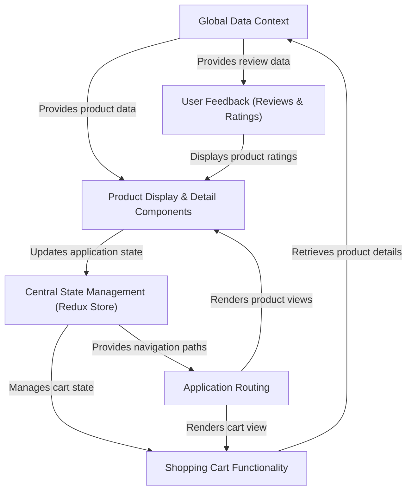

# Tutorial: Internship-Projects

This project is a user-friendly **e-commerce website** designed to showcase and sell products. It provides a *seamless shopping experience* by displaying products, allowing users to view detailed information, add items to a **shopping cart**, and see customer reviews and ratings. The application efficiently manages its data and user interactions using a combination of shared data context and centralized state management.

## Visual Overview

## Chapters

1. [Application Routing
](01_application_routing_.md)
2. [Product Display & Detail Components
](02_product_display___detail_components_.md)
3. [Global Data Context
](03_global_data_context_.md)
4. [User Feedback (Reviews & Ratings)
](04_user_feedback__reviews___ratings__.md)
5. [Central State Management (Redux Store)
](05_central_state_management__redux_store__.md)
6. [Shopping Cart Functionality
](06_shopping_cart_functionality_.md)

---

