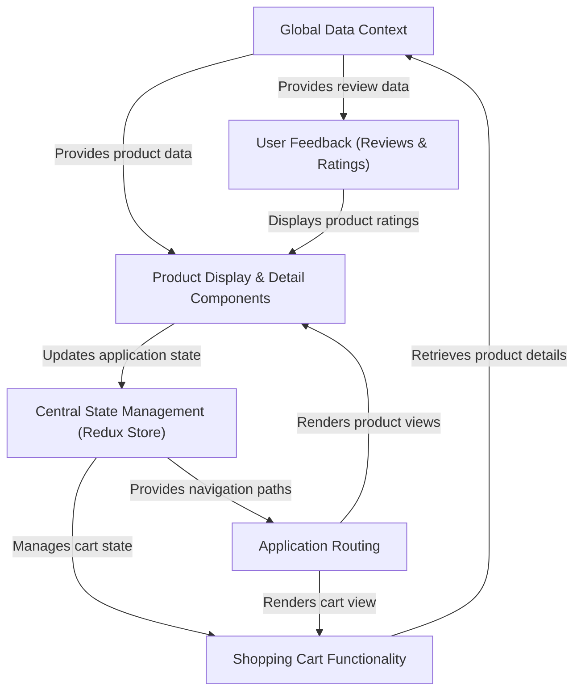

# Tutorial: Internship-Projects

This project is a user-friendly **e-commerce website** designed to showcase and sell products. It provides a _seamless shopping experience_ by displaying products, allowing users to view detailed information, add items to a **shopping cart**, and see customer reviews and ratings. The application efficiently manages its data and user interactions using a combination of shared data context and centralized state management.

## Visual Overview

## Chapters

1. [Application Routing
   ](Documentation/Chapter1.md)
2. [Product Display & Detail Components
   ](Documentation/Chapter2.md)
3. [Global Data Context
   ](Documentation/Chapter3.md)
4. [User Feedback (Reviews & Ratings)
   ](Documentation/Chapter4.md)
5. [Central State Management (Redux Store)
   ](Documentation/Chapter5.md)
6. [Shopping Cart Functionality
   ](Documentation/Chapter6.md)

---
