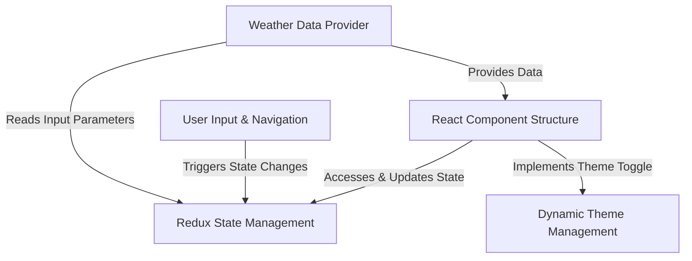

# Tutorial: Internship-Projects

This project is a **Weather App** that allows users to easily _check current weather conditions and forecasts_ for any city or their current location. It provides detailed information like temperature, humidity, wind speed, and a multi-day outlook. All weather data is presented through a _responsive and visually dynamic interface_ that supports both light and dark themes.

## Visual Overview

## Chapters

1. [React Component Structure
   ](01_react_component_structure_.md)
2. [User Input & Navigation
   ](02_user_input___navigation_.md)
3. [Redux State Management
   ](03_redux_state_management_.md)
4. [Weather Data Provider
   ](04_weather_data_provider_.md)
5. [Dynamic Theme Management
   ](05_dynamic_theme_management_.md)

---

Generated by [AI Codebase Knowledge Builder](https://github.com/The-Pocket/Tutorial-Codebase-Knowledge).
